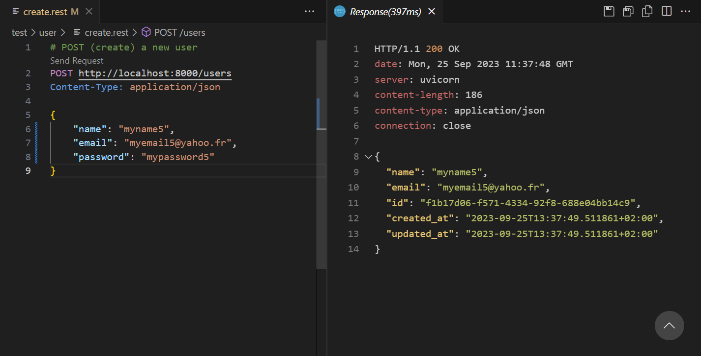
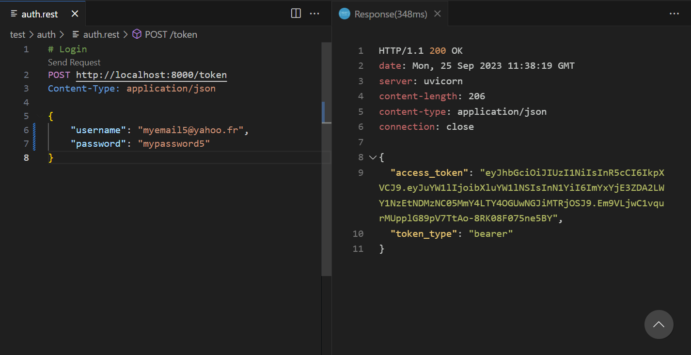
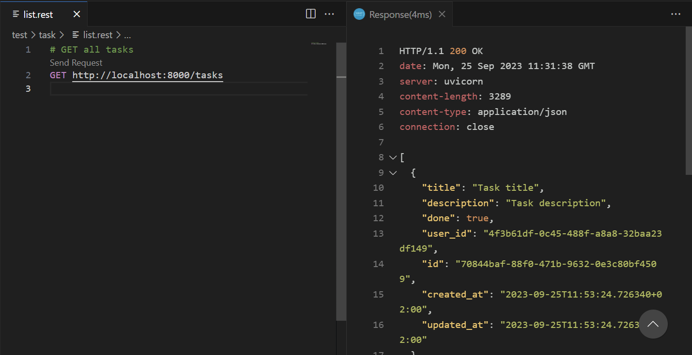
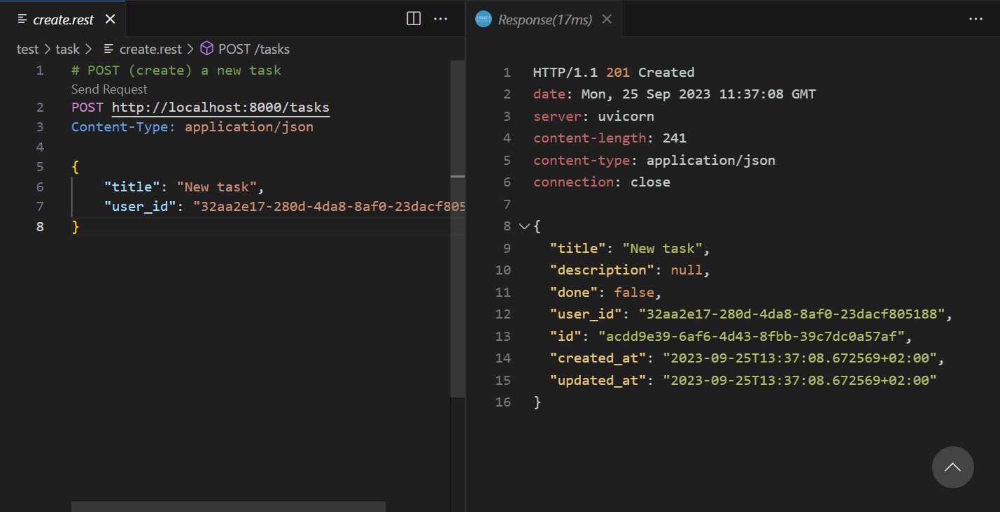
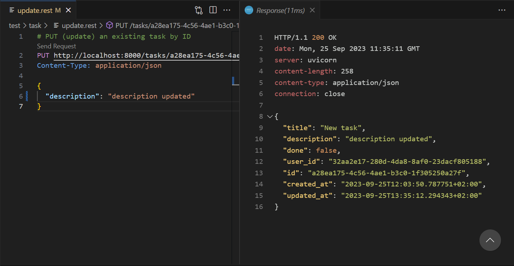

# MyTodos

A basic Task Management API created using the FastAPI framework. It allows you to manage tasks and users, by creating new tasks, updating existing tasks, retrieving task details, and deleting tasks. It also include an authentication feature using the OAuth 2.0 protocole. The data is persisted in a PostgreSQL database.

## What I Learned

- **FastAPI Framework**: Learned how to create and structure a RESTful API using FastAPI, focusing on routing, request handling, and dependency injection.

- **Database Integration with PostgreSQL**: Gained experience setting up and connecting to a PostgreSQL database, including configuring database credentials and managing tables.

- **Authentication with OAuth2**: Implemented basic authentication using OAuth2, learning how to secure API endpoints and manage access tokens.

- **Schema Design**: Practiced defining Pydantic models for request validation and response schemas, improving data handling consistency.

- **Environment Configuration**: Understood how to use .env files for secure storage of environment variables, such as database credentials.

- **API Testing and Debugging**: Explored debugging tools and tested API endpoints using tools like Postman or cURL.

## Installation

1. Clone this repository to your local machine:

   ```bash
   git clone https://github.com/mansouriothmane/task_management_api
   ```

2. Create a virtual environment for the project:

   ```bash
   python -m venv venv
   ```

3. Activate the virtual environment:

   - On Windows:

     ```
     venv\Scripts\activate
     ```

   - On macOS and Linux:

     ```bash
     source venv/bin/activate
     ```

4. Install the required packages:

   ```bash
   pip install -r requirements.txt
   ```

## Running the API Locally

To run the API locally, execute `main.py`, or use the following command from the command line:

```bash
uvicorn app.main:app
```

## Database Configuration

1. Create a PostgreSQL database.

2. In the `.env` file at the root of the project, assign the appropriate values for the following variables:

   - `DATABASE_PORT`
   - `POSTGRES_PASSWORD`
   - `POSTGRES_USER`
   - `POSTGRES_DB`
   - `POSTGRES_HOSTNAME`

## Database Tables

The API uses two SQL tables called 'tables' and 'users'. You can create these tables in your database by running the SQL queries in `app/tables.sql`.

## Endpoints

The API provides the following endpoints:

- Retrieve tasks from the database
- Create new tasks
- Update existing tasks
- Delete tasks

## Authentication

The API implements authentication using OAuth2. It includes routes for:

- Creating new users
- Authenticating users by providing a username and password and getting an access token in return.

## Models and Schemas

The project defines models to represent database entities. It also defines different schemas to manipulate data in the application, such as `TaskCreateSchema`, `TaskUpdateSchema`, `UserCreateSchema`, and more.

## Screenshots

### Create a user (POST)



- Add a new user to the database by providing a name, email and password.

### Authentication (POST)



- Providing a username (email) and a password and getting an access token in return.

### Task List (GET)



- Retrieve all tasks.

### Create a task (POST)



- Add a new task to the database.

### Update a task (PUT)



- Update an existing task.

### Delete a task (DELETE)


- Delete a task from the database.

## Possible Improvements

- Upgrade to SQLAlchemy 2.0
- Link Users to Tasks : Implement a relationship between the `users` table and the `tasks` table in the database schema to allow each user to have a list of associated tasks.
- Modify the task routers to use the `require_user` function as a FastAPI dependency.
